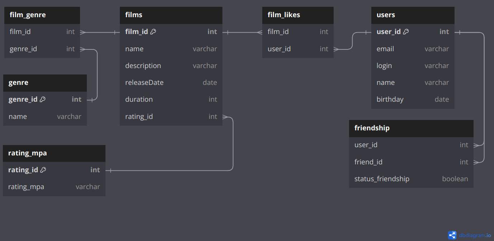

# java-filmorate
## Модель базы данных (ER-диаграмма)



### Примеры запросов в базу данных

<details><summary>Пользователи</summary>

Получение списка всех пользователей

```SQL
SELECT * 
FROM users
```

Получить пользователя по id
```SQL
SELECT * 
FROM users
WHERE user_id = 1
```

Получить список друзей пользователя

```SQL
SELECT u.name AS friend_name,
       u.login AS friend_login,
       sf.status_friendship
FROM friendship f
LEFT JOIN users u ON f.friend_id = u.user_id
WHERE f.user_id=1 and f.status_friendship=true

```
</details>

<details><summary>Фильмы</summary>

Получение списка всех фильмов

```SQL
SELECT * 
FROM films
```

Получить фильм по id
```SQL
SELECT * 
FROM films
WHERE film_id = 1
```

Узнать жанры фильма

```SQL
SELECT name AS genre
FROM films f
LEFT JOIN film_genre fg ON f.film_id =fg.film_id
LEFT JOIN genre g ON fg.genre_id = g.genre_id
WHERE f.film_id = 1
```

Получить топ 10 фильмов
```SQL
SELECT f.name AS film,
       count(fl.film_id) AS likes
FROM film_likes AS fl
LEFT JOIN films f ON fl.film_id=f.film_id
GROUP BY fl.film_id
ORDER BY count(fl.film_id) DESC
LIMIT 10
```
</details>